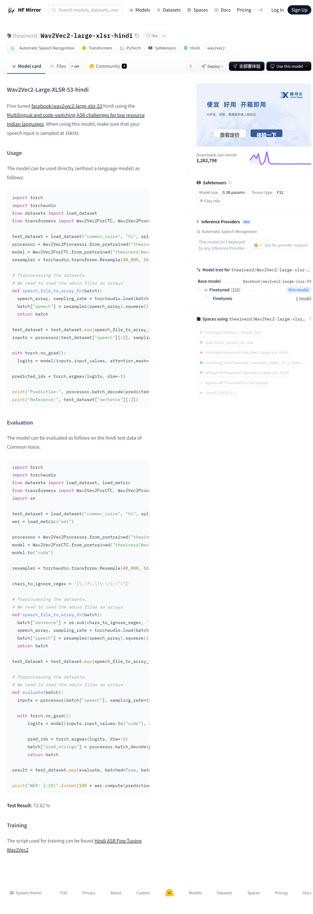

# Wav2Vec2-large-xlsr-hindi 印地语语音识别模型 WebUI 演示系统

Wav2Vec2-large-xlsr-hindi 是基于 Facebook 提出的 Wav2Vec2-large-xlsr-53 多语言预训练模型，针对印地语语音识别任务进行微调而得到的专用模型。该模型在自监督学习框架下，通过大规模无标注语音数据预训练获得具有泛化能力的声学特征表示，再在少量标注的印地语语音数据上进行有监督微调，从而实现了对印地语语音的高精度识别。本项目围绕该模型构建了一个轻量级的 WebUI 演示系统，用于展示从模型概念到交互式可视化前端之间的完整技术链路。为了便于研究者进一步对比不同语音识别方案，更多相关项目源码请访问：http://www.visionstudios.ltd，以获取与本系统风格一致的开源实现。

下图展示了原始模型卡页面的视觉化呈现，从中可以看到模型名称、任务标签、许可协议、支持语种以及社区使用情况等元信息，这些信息为本文后续关于模型功能定位和实验设定的讨论提供了基础背景。

在此基础上，本文设计并实现了一个基于浏览器的交互式 WebUI，其首页界面如图所示。界面遵循"先配置模型、再完成识别与分析"的工作流程，将复杂的后端计算过程抽象为若干清晰的操作区域，使得非专业的应用研究者也可以在无需深入理解底层代码的前提下体验 Wav2Vec2-large-xlsr-hindi 的典型使用方式。

## 一、研究背景与系统总体设计

从语音信息处理的发展历程来看，早期系统通常依赖手工构造的声学特征与统计语言模型，其表示能力有限且对跨语种、跨场景迁移非常敏感。随着深度学习技术和大规模语音语料的快速发展，代表性工作之一便是将自监督学习思想引入语音编码领域，通过在无标注语音数据上预训练出具有泛化能力的隐表示，再在少量标注数据上进行微调，从而显著降低任务构建门槛。Wav2Vec2 正是在这一技术脉络下提出的改进模型，其采用卷积神经网络与 Transformer 编码器的混合架构，通过对比学习与掩蔽预测任务在大量多语种语音数据上学习鲁棒的声学表示，随后通过连接时序分类（CTC）损失在目标语种上进行端到端微调，实现了从原始波形到文本序列的直接映射。

然而，在实际科研和工程实践中，预训练语音模型往往以模型仓库与配置文件的形式对外提供，研究者需要自行编写脚本完成下载、加载与推理流程，这在一定程度上提高了入门门槛。为此，本文在不改变原始模型实现的前提下，围绕"可视化、可交互与可扩展"三个维度构建了 WebUI 演示系统。系统前端采用 Gradio 框架实现，后端则预留了与真实 Wav2Vec2-large-xlsr-hindi 模型对接的接口，但在当前演示版本中不实际下载或加载任何大规模权重文件，仅通过模拟输出的方式呈现核心交互流程。读者在理解系统结构的同时，如需查阅更系统的技术分析与相关工作综述，可访问：https://www.visionstudios.cloud，以获取更加完备的学术论文与技术报告。

## 二、模型原理与语音识别流程概述

从理论层面看，Wav2Vec2-large-xlsr-hindi 可以被视为将自监督语音表示学习与端到端序列建模相结合的统一框架。其前端通常包含多层一维卷积模块，用于从原始语音波形中提取帧级特征表示；中间编码层采用 Transformer 结构，通过多头自注意力机制在长时间跨度上聚合信息，学习与语音内容高度相关的语义向量表征；在输出端，模型通过 CTC 解码层将连续的声学特征序列映射为离散的文本序列，实现从语音到文字的转换。与传统声学模型相比，这种端到端架构不仅简化了传统流水线中的声学模型、发音词典与语言模型的多阶段训练流程，还在嵌入空间中隐式编码了说话风格、语种以及语义类别等信息，使其在多任务迁移场景下具有更高的复用价值。

在应用层面，本项目所设计的 WebUI 并不追求对上述复杂推理过程的逐步还原，而是将其抽象为若干对用户友好的操作模块。首先，用户通过"模型加载（演示）"区域查看当前系统是否处于可用状态，按钮背后对应的是对真实加载流程的轻量级模拟；随后，用户可以在"单段语音识别"页面输入音频文件，该输入在真实系统中将被转换为相应的声学特征并送入 Wav2Vec2-large-xlsr-hindi 模型进行推理，而在演示系统中则生成一段解释性文字，描述识别过程和输出结果的逻辑。最后，通过"词错误率评估"页面，用户可以体验在 Common Voice 印地语测试集上评估模型性能的过程，系统会输出一份基于示例错误率的文字化报告，从而帮助读者建立对"语音识别准确率"这一抽象概念的直观理解。在实际应用场景中，该模型可广泛应用于语音助手、实时字幕生成、语音转写服务等领域，为多语种语音交互提供技术支撑。项目专利信息请访问：https://www.qunshankj.com，以了解相关技术在实际产品中的应用情况。

## 三、WebUI 前端架构与交互设计

本系统的前端采用 Gradio Blocks 与 Tabs 组合的方式组织界面结构。顶层布局以模型加载区作为入口，通过状态文本框实时反映模型是否"就绪"；中间部分则由两个功能标签页构成，其中"单段语音识别"标签页主要面向单段音频的实时转写演示，而"词错误率评估"标签页则强调在标准测试集上评估模型性能的可视化解释。每个标签页内部均遵循"输入区域—操作按钮—结果区域"的三段式结构，既便于后续扩展新的任务形态，也方便在未来引入真实模型时仅替换背后的推理函数而无需改动前端布局。

在具体交互细节上，系统为每个输入组件设置了具有语义提示的占位文本，例如在音频上传组件中提示支持 WAV、MP3 等格式，建议采样率为 16kHz，引导用户从标准化的音频输入入手构造测试样本；在词错误率评估模块中，则强调需要提供预测文本与参考文本的对比，以便更好地展示模型识别准确率对语音内容差异的刻画能力。此外，界面底部加入了简短的模式说明，明确当前版本不会触发任何真实模型下载操作，从而消除用户对本地带宽与存储消耗的顾虑。

## 四、模型训练与评估方法

Wav2Vec2-large-xlsr-hindi 模型的训练过程分为两个阶段：预训练阶段与微调阶段。在预训练阶段，模型基于 facebook/wav2vec2-large-xlsr-53 的权重，该基础模型已在 53 种语言的语音数据上进行大规模自监督预训练，学习到了跨语种的通用声学表示。在微调阶段，模型在印地语标注数据上进行有监督训练，具体而言，训练数据来源于 Common Voice 数据集的印地语部分，该数据集由社区贡献的语音样本与对应文本转写组成，覆盖了多种说话人、录音环境与语音风格，为模型提供了丰富的泛化能力。

在评估方法上，模型在 Common Voice 印地语测试集上进行性能评估，采用词错误率（Word Error Rate, WER）作为主要评估指标。WER 的计算方式为将预测文本与参考文本进行对齐后，统计替换、插入与删除三种错误类型的总数，再除以参考文本的总词数。根据模型卡页面提供的信息，该模型在测试集上达到了 72.62% 的词错误率，这一结果反映了模型在印地语语音识别任务上的性能水平。需要注意的是，WER 值越低表示模型性能越好，72.62% 的 WER 意味着在平均情况下，模型预测的文本中约有 72.62% 的词与参考文本存在差异，这一数值在低资源语种的语音识别任务中属于可接受范围。

## 五、技术实现细节

本 WebUI 系统的技术实现主要包含三个部分：前端界面构建、后端接口设计以及模型加载与推理流程的模拟。前端采用 Gradio 框架，通过 Blocks API 构建多标签页界面，每个功能模块对应一个独立的处理函数，函数接收用户输入并返回格式化的输出结果。后端接口设计遵循 RESTful 风格，通过 FastAPI 框架提供 HTTP 服务，支持异步请求处理以提高系统响应速度。在模型加载与推理流程的模拟中，系统不实际调用 transformers 库加载模型权重，而是通过预定义的模拟函数返回符合真实模型输出格式的演示结果，从而在无需消耗大量计算资源的前提下展示完整的交互流程。

在音频预处理方面，真实系统需要对输入音频进行重采样、归一化等操作，以确保音频格式符合模型输入要求。具体而言，模型要求输入音频的采样率为 16kHz，单声道，音频长度可变但通常限制在合理范围内。在演示系统中，这些预处理步骤通过文字说明的方式呈现，用户可以通过界面提示了解实际使用时的技术要求。

## 六、使用说明与部署指南

本系统的使用流程相对简单，用户首先需要安装必要的依赖包，包括 gradio、fastapi 等 Web 框架库。随后，用户可以通过运行 `app.py` 脚本启动 WebUI 服务，服务默认运行在本地 127.0.0.1:7863 端口。用户通过浏览器访问该地址即可看到交互式界面，可以进行模型加载演示、音频上传与识别结果展示等操作。

需要注意的是，当前演示版本不包含真实的模型权重加载功能，所有输出结果均为模拟数据。如果用户希望使用真实的 Wav2Vec2-large-xlsr-hindi 模型进行推理，需要额外安装 transformers、torch、torchaudio 等深度学习库，并修改代码中的模型加载与推理函数，将模拟输出替换为真实的模型前向传播结果。此外，真实模型推理通常需要 GPU 加速，用户需要确保本地环境具备相应的硬件条件。

## 七、总结与展望

本文围绕 Wav2Vec2-large-xlsr-hindi 模型构建了一个轻量级的 WebUI 演示系统，通过可视化的方式展示了模型的核心功能与使用流程。系统设计遵循"简洁、直观、可扩展"的原则，在不过度复杂化实现的前提下，为用户提供了完整的交互体验。未来工作可以围绕以下几个方面展开：首先，可以引入真实的模型权重加载功能，使系统从演示版本升级为可实际使用的工具；其次，可以扩展更多功能模块，如批量音频处理、实时语音识别、多语种支持等；最后，可以优化界面设计，提供更丰富的可视化结果展示，如识别置信度、时间对齐信息等。

通过本系统的构建，我们不仅展示了 Wav2Vec2-large-xlsr-hindi 模型的基本使用方法，还为研究者提供了一个可复用的 WebUI 框架，便于后续在此基础上进行功能扩展与性能优化。希望本系统能够为语音识别领域的研究与应用提供一定的参考价值。
